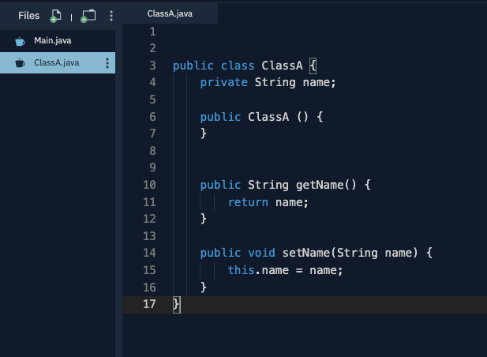
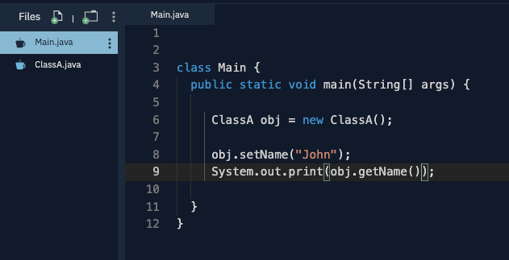
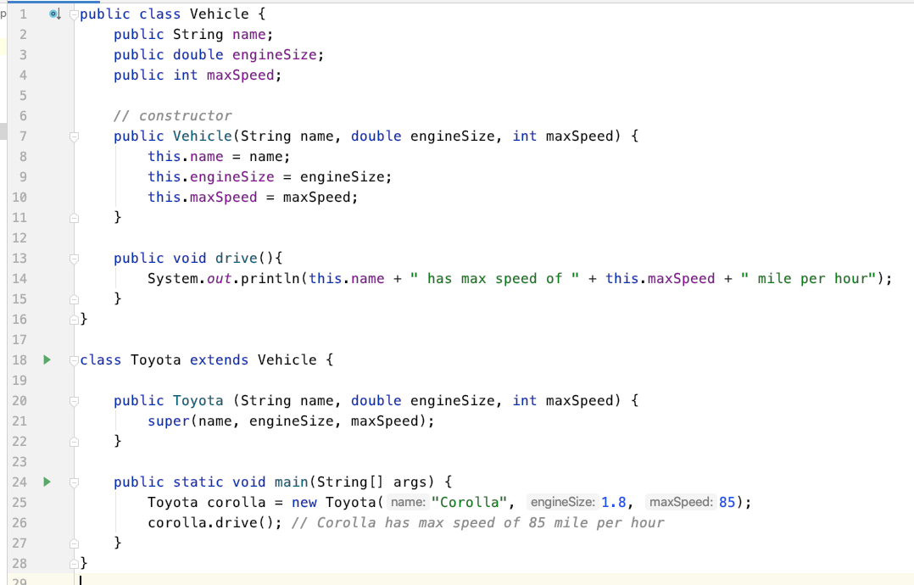
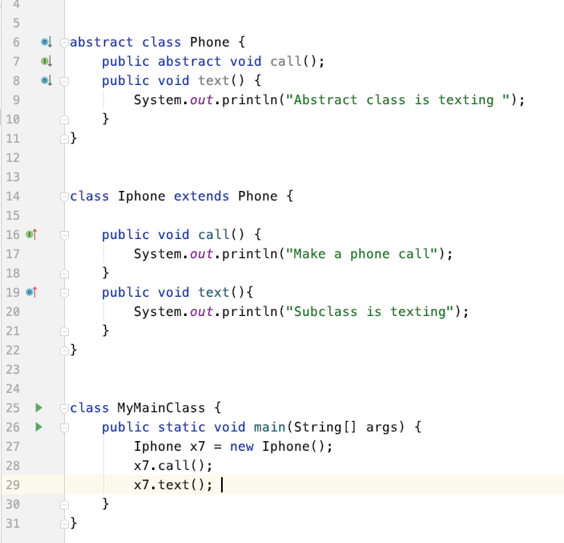
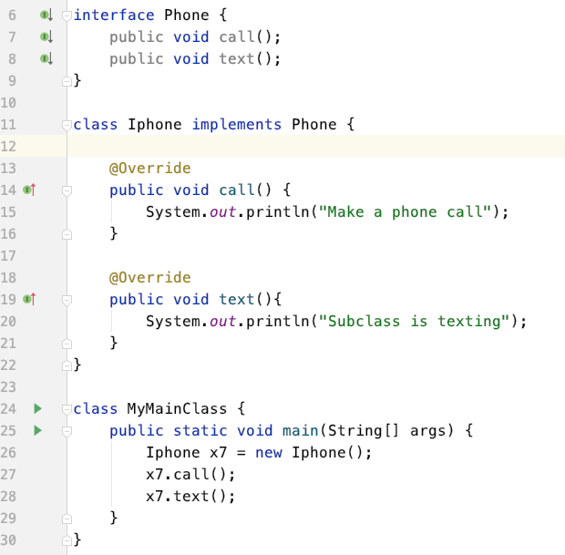

Object Oriented Programming Concept Questions

As you should know by now, there are 4 pillars of Object Oriented Programming.

********************
1. Encapsulation

Before understanding the encapsulation in Java, let's try to understand why this pillar called encapsulation. Well, in medicine encapsulation is a capsule consists of several medicines. In Java encapsulation is data hiding using several code. Encapsulated code includes private variable, getters and setters. So why do we need them ? Well we need to declare our variable as private and create getter method to get the value of that variable and setter method to set the value of that variable. So why do we need to use getter ? Why can't we access to that variable directly ? Well, the whole idea about encapsulating the code is hiding implementation details from users and to protect that variable from being mutated directly. Our job is to make sure no one can access to that variable outside of the Java class. By using the getter method we set read-only access to our variable and by setting setters we set write-only access. This really makes sure our variable will be safe and our code will be have less bug. This encapsulation concept can also be applied to constructors. Here is some example how to implement encapsulation:

 As we can see above, code is private means not accessible from outside of the class. But the only way to get its value is using getName method. In order to assign value we use setName method:

We instantiate a ClassA and set the value of the name variable to "John" and using the getName method we are able to get its value. Line 9 prints "John" to the console.

********************
2. Inheritance.

Inheritance is very common in programming languages. The main purpose of inheritance is to provide reusability of the code. Parent class defines common variables and methods which will be / can be used by one or more child classes. Child class inherits those methods and variables and adds only unique variables and methods inside a class. That way we can avoid DRY and maximize the reusability of our code. One of the biggest advantages of inheritance is all child classes can reuse the variables and methods that are already defined in the Parent class. Let's see some examples:

As we can see in the code, Toyota class inherits ( extends ) from Vehicle class and now Vehicle class field and methods are available for Toyota to use. There are so many types of cars now because of inheritance, all cars don't have to define all common methods and fields, instead they will be defined in super class ( Vehicle ). This is a very good example of code reusability.
when it comes to overriding, let's say super class has 10 methods, if we want to use 7 of them, and if we want to implement 5 of them directly but customize 2 of 7 then we need to override these 2 methods using @override annotation. 

Do we have to override methods ? not always. we have to override if we want to customize the method.
I read about it here https://stackoverflow.com/questions/36393008/is-it-bad-practice-to-use-inheritance-if-i-plan-to-override-all-the-methods#:~:text=To%20answer%20your%20question%3A%20It,can%20or%20should%20be%20used.&text=Of%20course%2C%20this%20is%20only,the%20new%20super%2Dtype%20I%20.

********************
1. Abstraction

Before understanding Abstraction in Java let's try to understand what abstract means ? It means giving general information and hiding the details. So abstraction in Java is the process of hiding details and implementations from the users. Let's take an example, all account users know that if they type login and password and click the "login" button they  know they can login to their account, but they really don't know how logging in works behind the scene. 
Now, let's see what abstraction is in Java. In java classes and class properties can be abstract. There are two ways to achieve the abstraction: using abstract class or using Interface. Let's talk about abstract class first.
We must use abstract keywords in front of the class to make it abstract class and in front of the method to make it abstract. Abstract class cannot be instantiated. Subclass must inherit abstract class to use its methods and field properties. Also it must be overridden to use an abstract method, but for non abstract methods if Subclass can override non abstract methods or can use Abstract class's non abstract method directly. Here is little code example about abstract class implementation:

Phone is a abstract class and it has abstract method called call. It also has a non abstract method called text. Since call is an abstract method it must be overridden. But text is optional. I overridden the text method in this example. So line 29 will run x7 method. But if we delete the text method from Iphone class then line 29 will run the abstract class's text method.

Since abstraction is achieved by using extends keyword I was confused a little bit, because inheritance uses the extends keyword too. But fortunately I found this article very useful to understand the fundamentals:
https://stackoverflow.com/questions/40626800/what-is-exact-difference-between-inheritance-and-abstract-class
So my conclusion is that abstraction is achieved using inheritance.

In Inheritance, it has to make a sense to inherit from class. We must use override if we want to override the super class method, but we don't have to always do that. If we want to use parent class methods directly we can, not using override annotation. Super class can be initialized and can have its own methods and fields.
In abstraction, the parent class cannot be instantiated, and uses an abstract keyword in front of the class name. In other words, in order to use inheritance, the parent class does not have to be an abstract class.

Let's talk about the second way of achieving abstraction using Interface. If we want to achieve 100% abstraction we use Interfaces. In Interface all methods are abstract. Interfaces can have a field as well and they must be public static final, i.e. they are constants. There are differences between abstract class and interfaces:
1. Subclass uses implement keyword to inherit from interface
2. Interface has only static type of variables
3. Interface has only abstract methods and all must be implemented by subclass.
4. Interface uses only public access modifiers.
5. Subclass can extends only one abstract class but multiple Interface classes

let's take the same code and convert it into interface:

As we can see, both methods are implemented in subclass and the interface has only method signature.

********************
1. Polymorphism

In Object Oriented Programming polymorphism is a very important concept. The meaning of polymorphism is poly means many and morph means forms so polymorphism is many forms ( meaning like one unit is being in several forms ). So in OOP polymorphism is using the single method in many forms, many ways, for different purposes. So how do we achieve that ? We achieve that by creating abstract methods (method signature ) inside an interface and defining the method body in the class based on the class requirements. Each method will have a different body for different implementation purposes.
For concrete example, let's say we have a different bank class that has overdraft methods. When we instantiate a bank class, each object will have a different way ( different overdraft charge fee ) of implementing overdraft method so instead of creating overdraft methods in each instance of the bank class, we define overdraft signature in the interface and make class bank implements interface. That way we achieve polymorphism, I mean we don't need to ???
Polymorphism achieved by overloading and overriding methods.
   Overloading a class has multiple methods with the same name but with different parameters.
   Overriding a subclass uses the super class's method ( same name, same parameters ) by adding specific information that belongs to the subclass.
   We use @overload and @override annotations to tell our code that these methods are being overloaded or overridden. 
 

Please write 1-3 paragraphs explaining these 4 concepts further.  Please provide a sufficient enough explanation about these pillars, as well as some examples to illustrate the practical use cases of these principles. 

