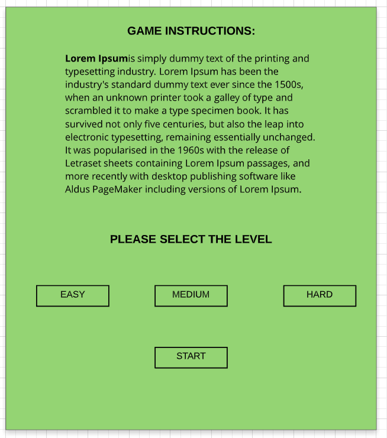
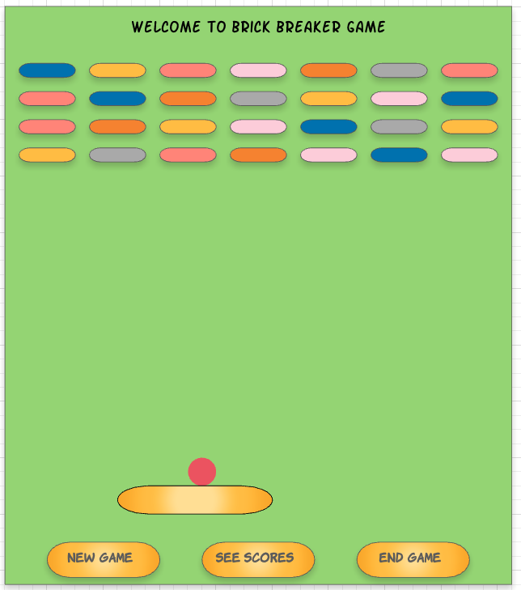

<h1>The Problem Solving Framework : 'UPER'</h1>

* U = "Understand"
* P = "Plan"
* E = "Execute"
* R = "Reflect" / "Refactor"

<h2>1. Understanding the Problem</h2>
  * I read the requirements carefully.
  * I have to build a terminal based 2D game, that must be fully functional, so users are able to play it.
  * I must implement OOP 4 pillars in the game. Those are, Encapsulation, Inheritance, Abstraction and Polymorphism.
  * I must have at least 1 interface, 1 abstract class, 1 lambda and 1 stream.
  * I must have at least one package. Also, error handling for bad input ( try catch ).
  

// Problems I have:
* I need to build a game
* I need to learn how to implement gaming libraries
* Learning about JFrame by watching tutorials and reading docs
* Learning how to create graphical user interface using JFrame
* I need to work on game logic. 
<h2>
   2. Planning the Solution
</h2>

* Checked each game examples on Github repo
* Watched tutorials about snake game, pong game and one Udemy tutorial video about Java Game processing library
* I made a list of the topics that I need to learn before I start building a game. So that is my list:
1. JFrame
2. JPanel, JButton, JLabel
3. KeyListener
4. Graphics,
5. ActionListener

 

 * Also using Lucidchart to create the wireframe of my game. I wanted to create 2 windows. I wanted to make the first window to be a game start window with game instructions and the second window to be an actual game window. Here is my game instructions window:
 
 
 

 As we can see, I want to make 3 difficulty levels of the game. Users can click on the level and click start to start the game. After starting the game here is what game should look like:
 
 

I planned to have random color bricks on the top of the window. Also 3 buttons under paddle and each button had specific functionality. One starts the new game. Second one sees scores and the last one ends the game. I planned to create a scoring feature when I have time. Based on the brick color the user earns a point and user can see it on by clicking see scores button.

*
<h2>
   3. Executing the Plan
</h2>

* Created images of bricks, paddle, ball and welcome title. I saved all in gameAssets directory. 

* I created 2 frames: Start window and Game window

* For each piece of the game, created Block class. Inside a Block constructor I used ImageIO read method to read the image of Block instances. Inside a Block, I also created createImage method that creates an image inside a Game Panel. 

* Game Panel has all the game logic. It is listening the keyboard, as soon as user clicks enter, it starts a new thread which invokes update method every 25 milliseconds. Created update method that moves the ball continuously, updates the wall and paddle location. 

* I have a working game, MVP. Now I can start refactoring and working on core requirements. 

<h2>
   4. Reflection / Refactor
</h2>

* Created IShape interface and Block abstract class.

* Implemented lambda in stream inside the createWall and update methods of GamePanel class 

* Have blocker: when I close the game window it is switching to start window but not closing the game window. Refactored, created one Main Window that toggles 2 Panels: StartPanel and GamePanel

* Created 2 subPanels for GameScreenPanel: GamePanel and ButtonPanel

* Created enum that holds 3 constants for game level. 

* Created 3 packages: game, main and start. Each package holds related classes. 

* Used Encapsulation in the GameBlock class, Polymorphism in GameBlock class overriding IShape interface and Block abstract class. MainWindow, GameBlock, StartScreenPanel, GamePanel, ButtonPanel classes used inheritance. 

* Implemented game mode in MainWindow

